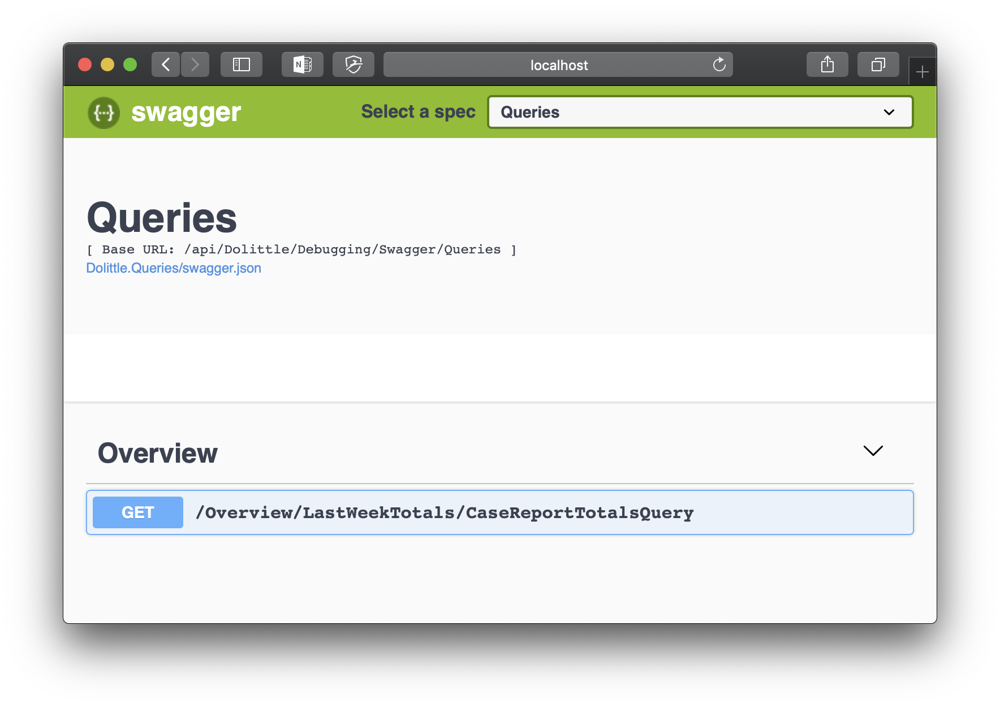

[Swagger](https://swagger.io) is a great tool for interacting with APIs on a webserver without the need for a custom UI. To enable the use of Swagger with a Dolittle AspNetCore Bounded Context, we expose special APIs and generate [OpenAPI](https://swagger.io/specification/v2/) documents based on Commands, Queries and Events in your bounded context. This allows for quicker development of the business logic and simplifies working on the domain and readmodels separately. Please note however that __these APIs are only ment as a development tool__ and not for production use.

# Enabling Swagger Debugging
First, install the `Dolittle.AspNetCore.Debugging.Swagger` NuGet package. For example by putting the following _PackageReference_ in your `Core.csproj` file.
```xml
<PackageReference Include="Dolittle.AspNetCore.Debugging.Swagger" Version="1.*" />
```

Next, add the required services in your `Startup.cs` file.
```csharp
public void ConfigureServices(IServiceCollection services)
{
    services.AddDolittleSwagger();
}
```

Lastly, enable the generated endpoints and the Swagger UI in your `Startup.cs` file.
```csharp
public void Configure(IApplicationBuilder app, IHostingEnvironment env)
{
    if (env.IsDevelopment())
    {
        app.UseDolittleSwagger();
    }
}
```

# Using the Swagger UI to interact with your Bounded Context
After starting the AspNetCore server with e.g. `dotnet run` in the `/Core` directory, the server will output its base URL - _http://localhost:5000_ for this example. 
```bash
Hosting environment: Development
Content root path: /Application/BoundedContext/Core
Now listening on: http://localhost:5000
```

Navigate to _/swagger_ - _http://localhost:5000/swagger_ for this example - in your favorite browser to access the Swagger UI. The page should look something like this:



In the top-right corner, you can select whether you would like to execute _commands_, _queries_ or inject _events_. The lower part of the page will list out all artifacts of your application grouped by _features_. Clicking on one of the artifacts will show its structure, and subsequently clicking on _Try it out_ will allow you to enter values for the artifact.


Finally, clicking on _Execute_ will execute the _command_, _query_ or inject the _event_, and show the results in a new panel. Below is an example of the result from a query execution.


## Notes about _TenantId_
All applications created using the Dolittle framework are __multi-tenant by default__. This means that everything happens in the context of a _tenant_, defined by its _tenantId_. Usually this is handled without you having to think too much about it, but to allow simple experimentation with data from multiple tenants, the _TenantId_ parameter is added to all endpoints in the SwaggerUI. By default this is set to the globally defined _Development Tenant_, but you are free to set this to any _GUID_ of your choosing. Just ensure that the _TenantId_ is defined in the `.dolittle/tenants.json` configuration file in your bounded context Core project.

## Notes about _Event_ injection
In production, _Commands_ are the only way to change the state of your Bounded Context. This tool however allow you to inject _events_ directly into the _Event Store_ to decouple development of _Commands_ and _Domain_ from _ReadModels_ and _Queries_. Be aware that this mechanism bypasses any validation that you might have in your Domain, so it might lead to a corrupt state of your application, and it is probably a good idea to start with a fresh event store when going back to domain development.

The debugging UI will also list events you have imported from other Bounded Contexts, so it is possible to debug multi bounded context applications without the need to run all of them at the same time and use the _Event Horizon_ to transport events between them.

The _EventSourceId_ parameter in the UI corresponds to the _Id_ of the _Aggregate Root_ that emitted the event. 